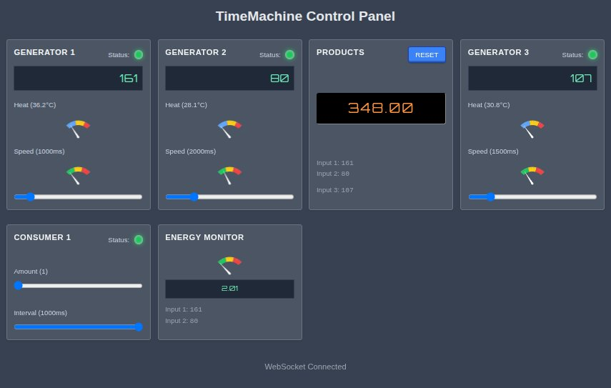

# TimeMachine

A real-time simulation game built with Clojure and the Biff web framework. TimeMachine simulates a production system with generators, products, and consumers in an interactive web interface.



## Features

- **Real-time Simulation**: Watch as generators produce resources, products accumulate, and consumers use them
- **Interactive Controls**: Toggle generators and consumers on/off, adjust speeds and consumption rates
- **Heat Management**: Generators produce heat as they run and must cool down if they overheat
- **Resource Monitoring**: Track production rates, consumption, and energy efficiency
- **WebSocket Communication**: Real-time updates between server and client

## Components

- **Generators**: Three generators that produce resources at configurable intervals
- **Products**: Accumulates resources from generators
- **Consumer**: Uses products at a configurable rate
- **Energy Monitor**: Tracks the efficiency of the system

## Getting Started

This project is built with [Biff](https://biffweb.com/), a Clojure web framework.

### Prerequisites

- Java JDK
- Clojure CLI tools

### Running the Application

1. Clone the repository
2. Run the development server:
   ```
   clj -M:dev dev
   ```
3. Visit `http://localhost:8080` in your browser

Consider adding `alias biff='clj -M:dev'` to your `.bashrc` for convenience.

## Development

- Run `clj -M:dev --help` to see available commands
- The simulation logic is in `src/de/com2u/timemachine/game.clj`
- The web interface is in `resources/public/game.html`

## License

This project is open source.
